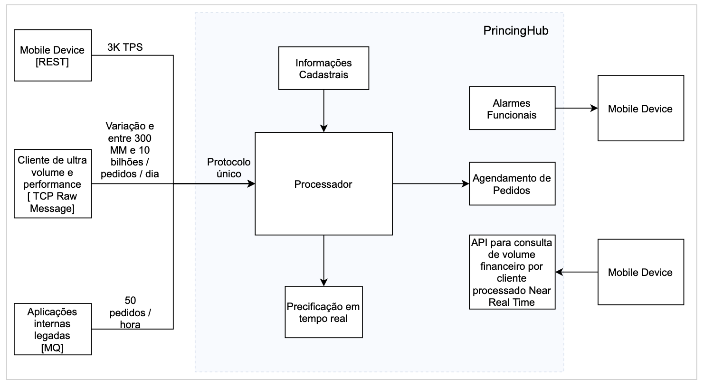

# Problema proposto

## Caso de uso
Você trabalha para a PricingHub, empresa responsável por processar compras de ativos extremamente voláteis e foi designado para dar solução para os principais desafios técnicos da companhia. A empresa recebe ordens de compras de diferentes sistemas (mobile, clientes especializados e clientes internos), cada um com seu respectivo volume e modelo de integração. Cada ordem de compra desses clientes é precificada e processada da seguinte forma:
1. Cliente envia uma ordem de compra para um determinado ativo. O pedido contém o nome do ativo, a quantidade e um token que identifica o cliente naquele momento.
2. O processador de ordens avalia qual é o código de precificação do ativo no dia, que pode variar entre MB, B, N, C, MA. Essa informação está disponível nas informações cadastrais que mudam apenas no batch noturno (assuma que a plataforma online funciona apenas em horário comercial) e é disponibilizada para você em forma de arquivo delimitado. Assuma que o tamanho total do arquivo de informações cadastrais nunca irá passar de 2GB.
3. O processador precisa recuperar os preço do ativo que é fornecido pelo sistema de precificação. Um token de clientes e o código de precificação por ativo te darão o preço do ativo naquele momento. A precificação pode ser acessada via API rest ou você pode consumir mensagens de divulgação de novos preços de ativo por cliente e código em near real time.
4. Uma vez que tem-se o preço do ativo naquele momento, o processador deve sensibilizar o agendamento de pedidos que, no contexto deste desafio, vai apenas persistir as informações em um local de sua escolha (banco, arquivo, etc). No entanto, no contexto desse desafio, assuma que esse agendador pode receber uma mensagem duplicada do processador e você precisa garantir que apenas uma ordem é agendada/persistida.
5. Todos os clientes, independente da forma como enviam ordens, tem acesso a um mobile device. Você precisa enviar um alarme near real time para os clientes caso o volume financeiro de ordens em uma janela de 30 minutos seja maior que R$ 50 milhões.
6. Você precisa disponibilizar uma API para consulta de volume financeiro por cliente em near real time, ou seja, você precisa disponibilizar a informação do volume o mais rápido possível para consulta via API.

## Restrições e expectativas
1. É esperado que você use arquitetura Coreografada. Você pode optar por qualquer modelo ou middleware que atenda os requisitos não funcionais.
2. Não é necessário tratar os temas com conceito de ultra baixa latência, mas é esperado que os volumes sejam atendidos dentro da janela comercial de processamento de ordens com atrasos aceitáveis na casa de alguns segundos.
3. É esperado que você detalhe o modelo de integração com entidades externas (API - Qual protocolo? Como vai expor? Como vai tratar autenticação/permissão?, Mensagens - Qual protocolo, qual middleare?, etc.)
4. Atente para como sua solução irá tratar a variação no fluxo de mensagens dentro do dia. É esperado que você enderece ter a infraestrutura mais enxuta possível.

## Entregável de arquitetura
1. Enriqueça esse diagrama com o máximo de detalhes possível sobre seu desenho de solução (Middlewares, protocolos, fluxo dos dados, modelos de integração, aponte os padrões de arquitetura utilizados), inclusive, adicione informações de como você irá tratar observabilidade da solução.

2. Explique como sua solução atende as situações abaixo:
    - Variação de fluxo de mensagens no tempo, chegando a picos de 10Bi mensagens/dia.
    - Garantia de processamento em caso de falha de algum dos componentes.
    - Como você identifica que alguma componente da solução não está saudável o mais rápido possível na observabilidade da sua solução (caiu, consumo excessivo de memória, apresenta algum log de erro)?
    - Recebimento de mensagens duplicas no agendamento de pedidos.
    - Disponibilização do volume financeiro por cliente em near real time.
    - Alarmes em near real time em janela de tempo
    - Tratamento de diferentes modelos de entrada de ordem dado um protocolo único de entrada para o processador.

3. O entregável é um diagrama de solução arquitetural detalhado e um documento com respostas para os questionamentos acima.

## Entregável de desenvolvimento
1. Na arquitetura que você desenhou, implemente o processo de pedidos envolvendo desde do cliente de ultra volume, utilizando TCP até o agendamento de pedidos (incluindo eventuais componentes adicionais que você tenha desenhado). Não é necessário implementar o alarme ou API, no entanto, esses dois pontos precisam estar bem detalhados em como solucionar o desafio na sessão de arquitetura. Não é necessário implementar observabilidade nesta entrega, mas é importante que as integrações funcionem e que consigamos executar os códigos. Também sinta-se à vontade para mockar dados, serviços, etc.

2. Restrições:
    - Utilize Java. Na versão que se sentir mais confortável.
    - No contexto do desafio de engenharia, não será permitido armazenar os `dados cadastrais` em nenhum banco de dados. Você deve implementar algo para armazenar esses dados em alguma estrutura em memória que entenda fazer mais sentido e ter melhor performance.
    - Não é permitido fazer persistência de dados de forma síncrona. 
    - O entregável aqui é código funcionando!
