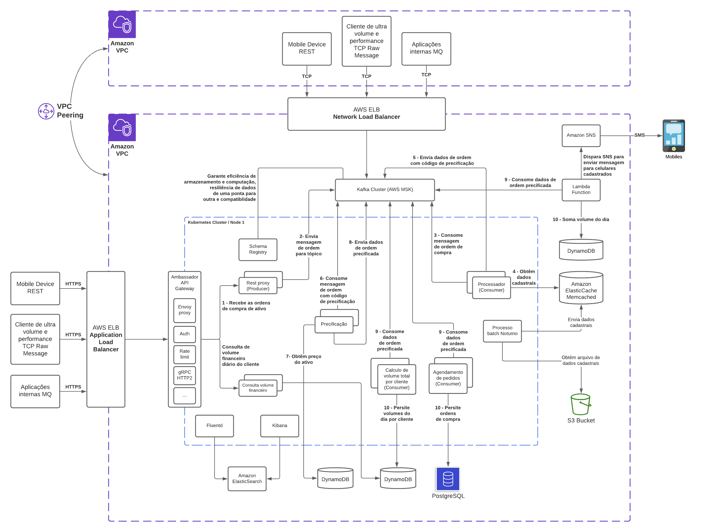
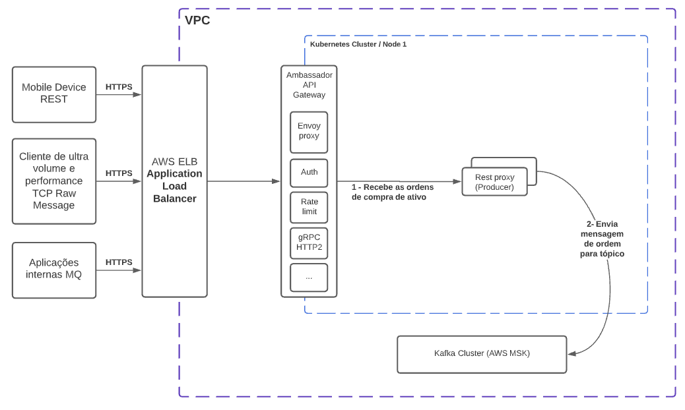
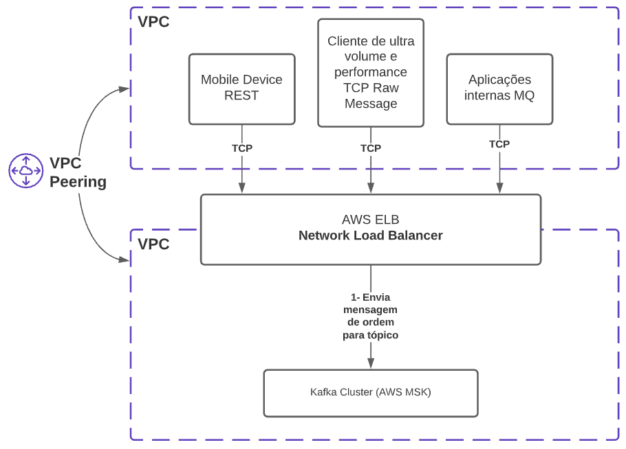
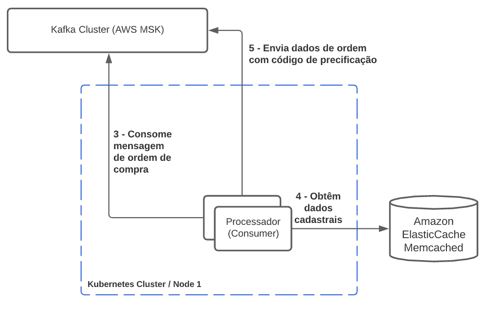
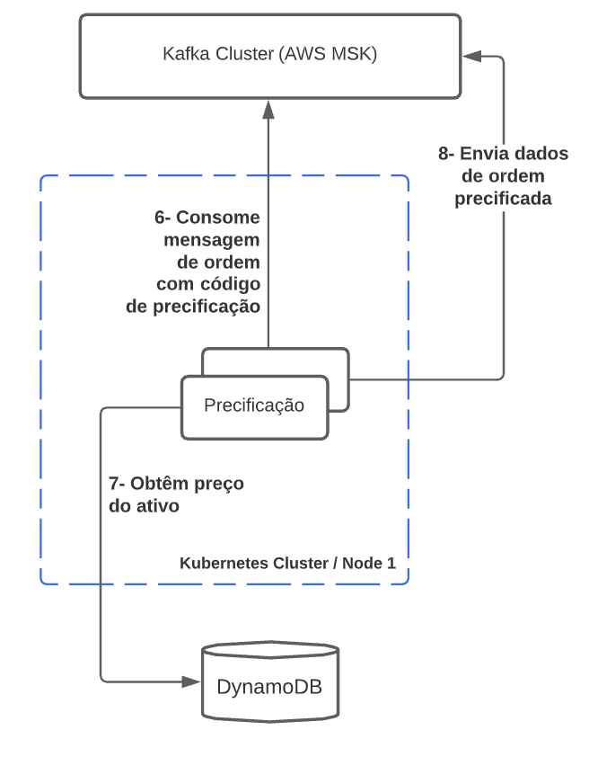
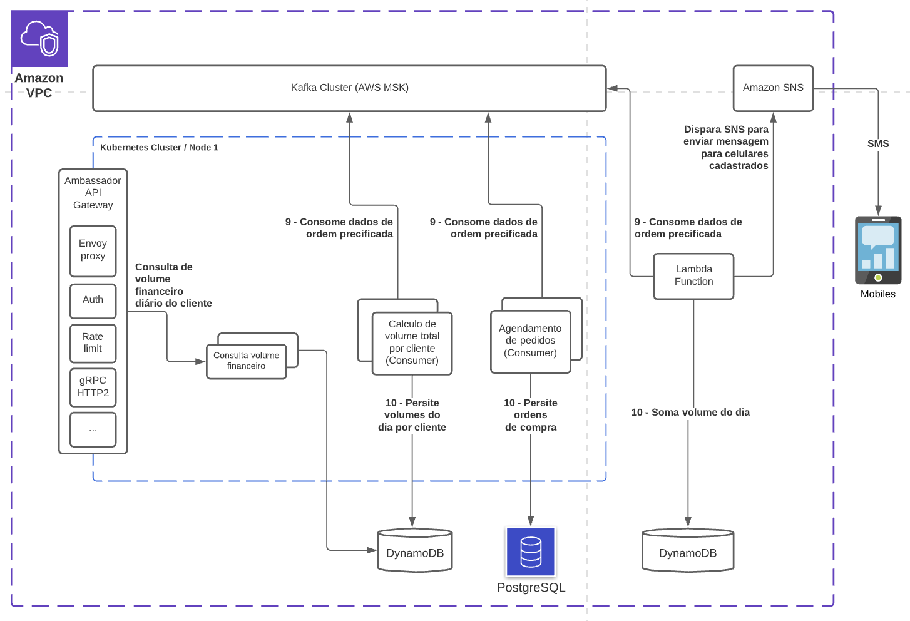
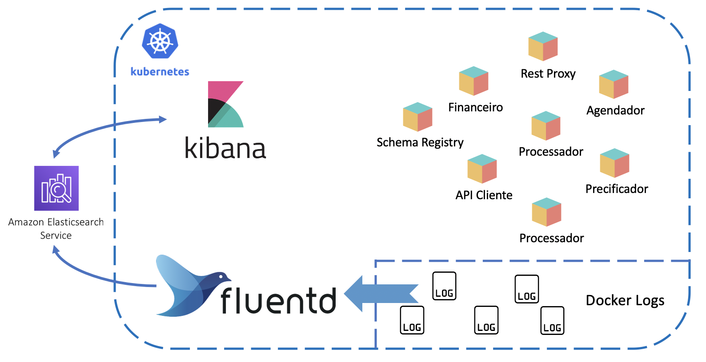

# Solução de arquitetura

Para esse problema fiz um desdobramento de outras duas. Em caso de comunicação de aplicação, onde as aplicações externas estão fora da rede e em caso de comunicação por rede, onde as aplicações fazem parte da rede.

Nas duas soluções o que muda é a comunicação direta ou indireta com o Kafka Cluster.



## Envio de ordem de compra de ativo ao processador

### Comunicação fora da rede (HTTPS)
Antes de chegar ao processador temos alguns caminhos. Na primeira solução coloquei aplicações externas fora da rede enviando dados de ordem para serem efetivadas



Nesse caso as comunicações seriam através de HTTPS e passariam por um AWS Elastic Load Balancer (Application Load Balancer) e seriam roteadas até o Ambassador API Gateway. 

O [Ambassador](https://www.getambassador.io/products/edge-stack/api-gateway/) por sua vez já oferece segurança, autenticação, integração com o Kubernetes (`ingress controller`), TLS, circuit breaking, load balancing, entre outras features que podem ser visualizadas no site. 

O Ambassador por sua vez rotearia a requisição para o `rest-proxy`.

O Confluent fornece oferece o `rest-proxy` um plugin Kafka Rest de código aberto que pode ser usado para chamar o Apache Kafka por meio de chamadas REST. Além disso, o REST Proxy expõe a maioria dos recursos dos produtores, consumidores e ferramentas de linha de comando Java.  

O Rest Proxy simplesmente estaria enviando o payload para o tópico `ordem-ativo`
```
curl \
-iXPOST 'http://localhost:8082/topics/ordem-ativo' \
-H 'Accept: application/vnd.kafka.v2+json' \
-H 'Content-Type: application/vnd.kafka.json.v2+json' \
-d '{ "records": [ { "value": { "ativo": "WEGE3", "quantidade": 100, "token": "vitor" } } ]}'
```

Após esta chamada o `rest-proxy` terá produzido a mensagem em uma das partições criadas no tópico `ordem-ativo`.


###  Comunicação dentro da rede (TCP)
Para aplicações internas onde existe a possibilidade de uma comunicação via TCP o indicado é que as aplicações enviem mensagens diretamente para o tópic `ordem-ativo`



No imagem acima simulei duas VPCs e entre elas um VPC peering para que uma comunicação por TCP fosse possível. Entre elas existiria um Network Load Balancer que de acordo com a AWS ele pode lidar com milhões de requests por segundo.

## Processador
O processador irá consumir mensagens que virão do tópico `ordem-ativo`



Para cada ordem de compra enviada o processador irá obter o código de precificação do ativo daquele dia que estará armazenado no Memcached da AWS.

Para o tipo de dado que deve ser armazenado uma simples `key-value structure` o Memcached tem uma ótima utlização de memória e é multithread, isso significa que ele consegue utlizar multiplos cores, diferente do Redis. Memcached supera o Redis no armazenamento de dados de 100k ou mais. Embora o Redis também tenha feito algumas otimizações para armazenar big data, ele ainda é inferior ao Memcached.

Após obter o código de precificação a mensagem da ordem de compra com o código é enviada ao tópico `ordem-ativo-precificar`

## Precificador
O processador irá consumir mensagens que virão do tópico `ordem-ativo-precificar`



Para cada ordem de compra com o código de precificação o precificador irá obter o valor de precificação do ativo em um banco de dados NoSQL e irá multiplicar pela quantidade de ativos da ordem resultando no valor total da ordem.

```
total da ordem = preço do ativo * quantidade
```

Agora a ordem precificada irá ser enviado ao tópico `ordem-ativo-precificado` que será processada por diversos outros consumers

O DynamoDB foi escolhido por ter suporte a index secondário e escala automaticamente para cima ou para baixo ajustando a capacidade e manter o desempenho. Isso junto com o cache na memória totalmente gerenciado,o que reduz o tempo de leitura para microssegundos para suportar mais de 10 trilhões de solicitações por dia e picos de mais de 20 milhões de solicitações por segundo.

## Registrar Ordem de Compra, Push Notification e Consulta de Volume Diário

Após a ordem de compra estar precificada e com seu valor total ela pode seguir prosseguir outros eventos.



Como é visualizado na imagem após precificada a ordem será consumida por 3 serviços consumidores e uma API.

1. Consumer - Agendador de ordem de compra
    - O agendador irá consumir a mensagem do tópico `ordem-ativo-precificado` e irá registrar no banco de dados
2. Consumer - Financeiro
    - O financeiro irá obter o valor total da ordem irá somar ao valor de ordem de compra de ativos do cliente que já fora enviado e irá atualizar o banco de dados.
3. Consumer - Lambda Function
    - O financeiro irá calcular o valor total das ordens do dia e caso passe do valor configurado para o dia enviará uma mensagem SMS para todos os celulares cadastrados.
4. API - Cliente Financeiro
    - Irá obter o valor total de ordem por cliente

Todas essas ações serão acionadas ao mesmo tempo caso não estejam em processamento e são independetes uma da outra fazendo com que o resultado esperado seja obtido de forma muito mais rápida comparado de quando se tem uma comunicação síncrona.

O Lambda function foi escalado por ser muito mais barato e ter uma performance melhor com serviços da própria AWS, no caso DynamoDB e Amazon SNS. Mas caso colocassemos outros pontos como gerenciamento, custo humano de gerenciamento, CI / CD, entre outros vários pontos faria sentido a criação de um serviço que fosse containerizado e publicado no K8s.

O PostgreSQL foi colocado para armazenar as ordens de forma normalizada e suas transações seguem o princípio ACID. Isso significa que a validade dos dados é confiável. Não foi colocado no problema mas imagino que as ordens ficariam relacionadas a outros tipos de dados talvez, e isso é mais um motivo para que um banco de dados relacional fosse utilizado.

No caso da soma de valor diário de ordens por cliente não é necessária apenas consistência dos dados na tabela e isso o DynamoDB consegue garantir, além de que é um registro de chave-valor com data do dia como index secundário.

O SMS torna perfeito a comunicação do alerta para qualquer tipo de mobile, logo não tinha muito o porque considerarmos outro serviço que não fosse o Amazon SNS garantindo a segurança dos dados, facilidade de comunicação de desenvolvimento e monitoramento que precisariamos.

## Monitoramento e Logging
Para suprir o problema de observabilidade considerei a implantação do agent Fluend, o ElasticSearch como serviço na AWS e o Kibana para apresentar os logs.



Com Fluentd o programador não precisaria fazer nada, todos os logs das aplicações seriam capturadas por ele que por sua vez seriam enviadas para o ElasticSearch. O Kibana entra como um facilitador para visualizar os logs, criar as métricas e alertas em caso de problemas.

## Respondendo as questões do desafio

1. Variação de fluxo de mensagens no tempo, chegando a picos de 10Bi mensagens/dia.

    Resp.: A arquitetura foi desenvolvida para que não houvessem gargalos em nenhum ponto de negócio. Os load balancers garantem milhões de requests por segundo, que por sua vez seriam recebidas pelo Kafka. 
    
    O Kafka estaria armazenando os dados em binário Avro já que na solução estou considerando o Schema registry, o faz melhorar a performance da comunicação, pois não é preciso mais trafegar texto entre Kafka/Consumer/Producer. O Consumer/Producer por sua vez armazena em cache o Schema garantindo a velocidade de transformação do dado.

    Para um maior Throughput devem ser configuradas mais partições, não é recomendado mais que 50 partições por tópico, pois mais partições é igual a mais utilização do CPU. O throughput deveria ser analisado e as partições deveriam ser aumentadas conforme a necessidade. 

    O número máximo de pods do Consumer deve refletir o número de partições, já que não faria sentido ter mais consumer do que partições, pois ficariam em `idle`. Também deve ser configurado o aumento de pods conforme a necessidade de computação e processamento paralelo, existindo uma economia de dinheiro em momentos de baixo tráfego de dados.

    Todos os outros serviços que estão fora do Kubernetes (DynamoDB, ElasticSearch, PostgreSQL, Memcached, Lambda Function) são gerenciados pela AWS e se bem configurados garantem ótima performance.

    Para o DynamoDB seria bom um auto scaling para suprir o `read` e `write` na base de dados. 

    Logo essa arquitetura consegue diminuir e economizar dinheiro em momentos de baixo tráfego e escala bem e rápido em momentos de alto tráfego fazendo com que o throughput seja alto.

2. Garantia de processamento em caso de falha de algum dos componentes.

    Resp.: O processamento é garantido pelo simples fato de estar utilizando o Kafa para armazenar as mensagens que são enviadas pelos Producer.

    Caso um dos componentes de negócio falhe a mensagem ainda estará lá para ser consumida e processada.

    O Kafka ainda oferece viagem no tempo, o que isso quer dizer? Que podemos voltar ao offset da partição que queremos processar em caso de falha em algum ponto ou até mesmo falha de negócio.

    O Kafka se bem configurado me garante replicação dos dados e caso um dos Brokers falhe ele elege outro broker líder.

    [Aqui escrevo um pouco sobre o Kafka e o porque da utilização.](https://www.linkedin.com/pulse/apache-kafka-para-iniciantes-vitor-tadashi/)

3. Como você identifica que alguma componente da solução não está saudável o mais rápido possível na observabilidade da sua solução (caiu, consumo excessivo de memória, apresenta algum log de erro)?

    Resp.: Como coloca lá em cima no item "Monitoramento e Logging" considerei o EFK (ElasticSearch, Fluentd e Kibana) na solução observabilidade da solução. Existem muitas outras soluções boas como Instana, mas considerando um custo baixo fluentd atende muito bem na captura e transformação dos logs de uma forma que fique fácil para os desenvolvedores criarem dashboard com métricas e alertas em caso de emergências.

    O Kubernetes por sua vez irá checar a saúde dos pods garantindo que sempre existam serviços consumidores saudáveis em execução.


4. Recebimento de mensagens duplicas no agendamento de pedidos.

    Resp.: Para garantir que mensagens duplicadas não sejam deverá ser implementado a pattern "Idempotent Consumer", para isso só dois elementos são necessário, ter uma chave única que identifique a mensagem, no caso a ordem e um repositório idempotente.

    [Mais informações sobre o padrão aqui](https://pradeeploganathan.com/patterns/idempotent-consumer-pattern/) e [aqui](https://microservices.io/patterns/communication-style/idempotent-consumer.html)

5. Disponibilização do volume financeiro por cliente em near real time.

    Resp.: Como mostra na solução o volume financeiro é calculado assim que a ordem é precificada, não concorrendo com nenhum outro processamento. E sendo disponibilizada pelo DynamoDB e consumida através de uma API. 

6. Alarmes em near real time em janela de tempo

    Resp.: Como mostra na solução o cálculo total do volume financeiro no dia é feito em um processo a parte pelo Lamda assim que a ordem é precificada, não concorrendo com nenhum outro processamento. Assim que o volume atinge o valor configurado a função aciona o SNS que por sua vez irá enviar o SMS para os números cadastrados.

7. Tratamento de diferentes modelos de entrada de ordem dado um protocolo único de entrada para o processador.

    Resp.: Este problema foi tratado no item `"Envio de ordem de compra de ativo ao processador"`